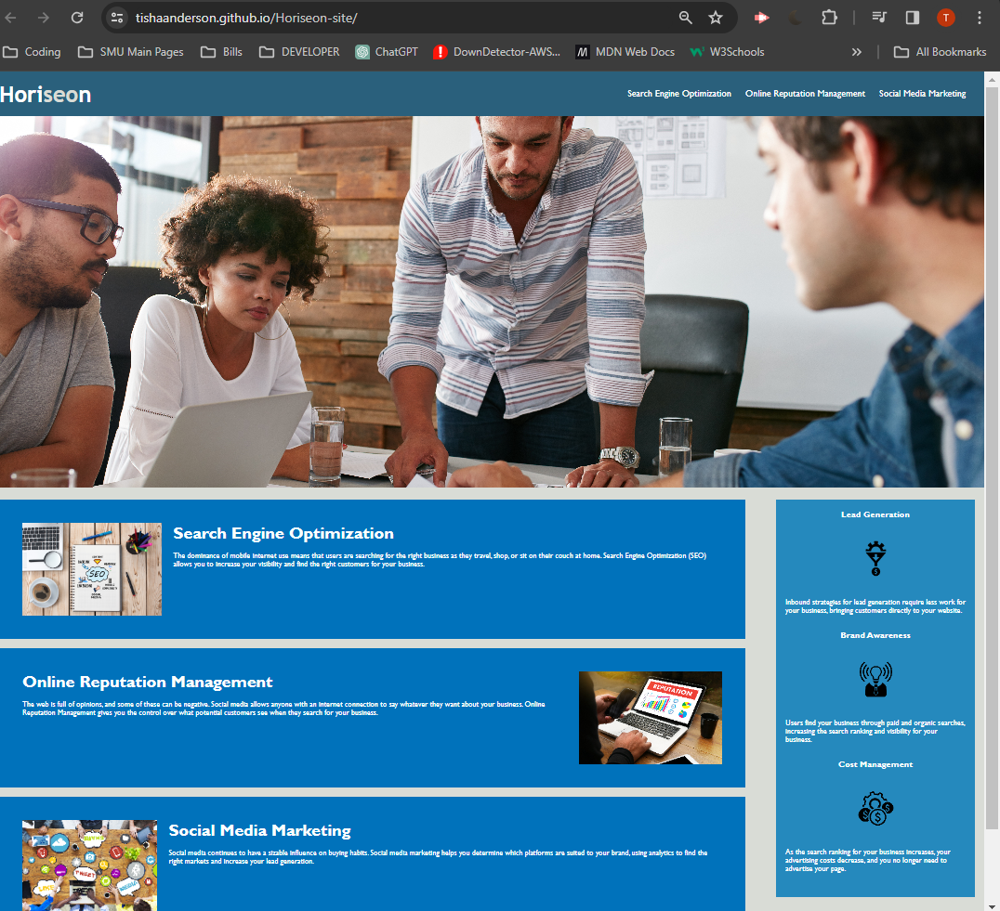

# Horiseon-site (Challenge 1 - HTML/CSS)

## Description

Refactoring existing code (improving it without changing what it does) to meet a certain set of standards or to implement a new technology is a common task for front-end and junior developers. For this particular Challenge, a marketing agency has hired you to refactor an existing site to make it more accessible.

An increasingly important consideration for businesses, web accessibility ensures that people with disabilities can access a website using assistive technologies like video captions, screen readers, and braille keyboards. Accessibility is good for business—for one thing, accessible sites rank higher in search engines like Google. It also helps companies avoid litigation, which might arise if people with disabilities can't access a website.

Accessibility can include complex requirements, but your tech lead has given you a small list of specific criteria for this project. These criteria are documented in the Acceptance Criteria section.

To impress clients, you should always exceed expectations and improve the codebase for long-term sustainability. For example, check that all links are functioning correctly. You can also increase the efficiency of the CSS by consolidating the selectors and properties, organizing them to follow the semantic structure of the HTML elements, and including comments before each element or section of the page.

## Table of Contents

- [Description](#description)
- [User Story](#user-story)
- [Acceptance Criteria](#acceptance-criteria)
- [Sample](#sample)
- [Links](#links)
- [Credits](#credits)
- [License](#license)

## User Story

```
AS A marketing agency
I WANT a codebase that follows accessibility standards
SO THAT our own site is optimized for search engines
```

## Acceptance Criteria

```
GIVEN a webpage meets accessibility standards
WHEN I view the source code
THEN I find semantic HTML elements
WHEN I view the structure of the HTML elements
THEN I find that the elements follow a logical structure independent of styling and positioning
WHEN I view the icon and image elements
THEN I find accessible alt attributes
WHEN I view the heading attributes
THEN they fall in sequential order
WHEN I view the title element
THEN I find a concise, descriptive title
```

### Sample



### Links

Live link: [Horiseon Home](https://tishaanderson.github.io/Horiseon-site/)

#### Credits

[Full-Stack Blog HTML Cheatsheet](https://coding-boot-camp.github.io/full-stack/html/html-cheatsheet)

[MDN Web Docs on HTML Elements](https://developer.mozilla.org/en-US/docs/Web/HTML/Elementhttps://developer.mozilla.org/en-US/docs/Web/HTML/Element)

[W3Schools HTML a href Attribute](https://www.w3schools.com/tags/att_a_href.asp#:~:text=The%20href%20attribute%20specifies%20the%20URL%20of%20the%20page%20the,top%20of%20the%20current%20page!)


#### License

Copyright (c) Microsoft Corporation. All rights reserved.

Licensed under the [MIT](LICENSE.txt) license.

[](https://opensource.org/licenses/MIT)